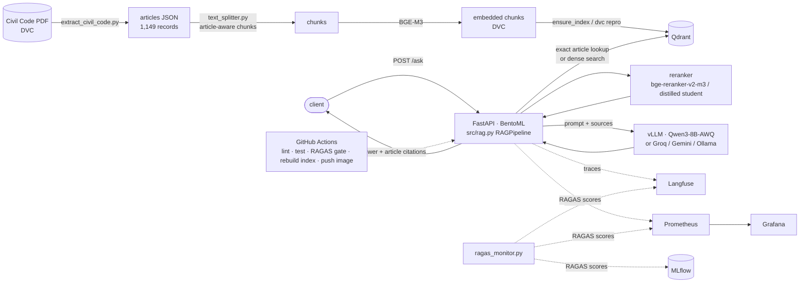
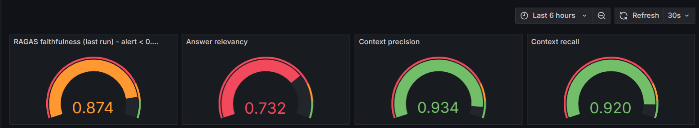

# Egyptian Civil Code — Arabic/English Legal RAG

Ask questions about the Egyptian Civil Code (Law No. 131 of 1948) in Arabic or English and get an
answer **with article citations** — never chunk ids. Hallucinations are unacceptable in legal work,
so every answer is generated only from retrieved articles, repealed articles are flagged, and
quality (RAGAS) is gated in CI and monitored in production.

```json
POST /ask   {"question": "ما هي شروط العقد؟"}
->          {"answer": "...", "sources": ["Egyptian Civil Code, Article 89", "Egyptian Civil Code, Article 90"]}
```

## Quick start (3 commands)

```bash
git clone https://github.com/AhmedYasser06/Egyptian-Civil-Code-RAG.git && cd Egyptian-Civil-Code-RAG
pip install "dvc[s3]==3.67.1" && dvc pull                    # corpus + embeddings from the DVC remote
cp .env.example .env && docker compose up --build            # add GROQ_API_KEY to .env first (or GOOGLE_API_KEY)
```

Then (the first request downloads BGE-M3 and the reranker, ~4.5 GB, into a Docker volume):

```bash
curl localhost:8000/health
curl -s -X POST localhost:8000/ask -H 'Content-Type: application/json' \
     -d '{"question":"ما هي شروط العقد؟"}'
curl -N -X POST localhost:8000/ask/stream -H 'Content-Type: application/json' \
     -d '{"question":"What does Article 147 provide?"}'        # tokens arrive progressively
```

`docker compose` starts **Qdrant + the API**. The API image contains the DVC-tracked corpus and
embedded chunks; on start `src/scripts/ensure_index.py` loads them into Qdrant (idempotent).
`docker compose build --build-arg PRELOAD_MODELS=true` bakes the model weights in for offline start.
Fully local, no API key: `LLM_PROVIDER=OLLAMA`, or on a GPU `docker compose --profile gpu up`
with `LLM_PROVIDER=VLLM`.

## Architecture



| Layer | Choice |
|---|---|
| Corpus | PDF → structured JSON (one record / article, repealed flagged), DVC-tracked, validated by `tests/test_corpus.py` |
| Chunking | article-aware (never cuts across articles), configs compared in MLflow |
| Embeddings / rerank | `BAAI/bge-m3` / `BAAI/bge-reranker-v2-m3` (+ distilled student) |
| Vector DB | Qdrant (article number, book/chapter/section, repealed flag in payload) |
| LLM | Qwen3-8B-AWQ on **vLLM** (production), Groq / Gemini / Ollama (dev) |
| Serving | FastAPI `/ask` + **BentoML** (async, streaming) |
| Tracking / versioning | **MLflow** (runs + Registry), **DVC** |
| Quality | **RAGAS** (faithfulness, answer relevancy, context precision / recall) |
| Observability | **Langfuse** traces, Prometheus + Grafana, cosine drift, token cost, alerts |

## API

| Endpoint | |
|---|---|
| `POST /ask` | `{question}` → `{answer, sources}`. `question` ≥ 2 chars after trimming, else **422**. |
| `POST /ask/stream` | server-sent events: `token` … `sources` |
| `GET /health` | `{"status": "healthy", "documents_indexed": N}` (N = articles in Qdrant; 503 if Qdrant is down) |
| `GET /metrics` | Prometheus (latency per stage, tokens, cost, drift) |
| `GET /drift` | cosine drift of recent queries vs the reference set |
| `/api/v1/legal/*` | original v1 routes (kept) |

Package: `pip install -e .` then `civil-rag ingest` / `civil-rag query "..."` (`src/rag.py`).

## Experiments, data, CI

* **MLflow** — chunking sweep (5 configs: `chunk_size`, `overlap`, `embedding_model`, RAGAS
  `faithfulness` + 3 other metrics per run): `python -m src.mlflow.chunking_ragas_sweep` (run on a
  GPU, notebook `notebooks/kaggle_1_mlflow_ragas_sweep.ipynb`). Winner is registered as
  `civil-code-rag-chunking` (alias `production`, stage *Production*). `mlflow ui --backend-store-uri sqlite:///mlflow.db`
  → screenshots in `reports/`.
* **DVC** — `data/raw/egyptian_civil_code.pdf` and every stage output are tracked;
  `git checkout <rev> && dvc pull && dvc repro` rebuilds the corpus, chunks, embeddings and the index.
* **CI/CD** (`.github/workflows/ci.yml`): ruff → pytest → **RAGAS gate** (fails if faithfulness < 0.75 on
  the 20-question set, or if the report is stale vs the corpus) → pull corpus + validate + rebuild Qdrant
  index → build, smoke-test and push the image to `ghcr.io/ahmedyasser06/egyptian-civil-code-rag`.

## Serving, load test, optimization

* **Serving**: vLLM (`Qwen/Qwen3-8B-AWQ`) + BentoML — `src/serving/bento_service.py`; see the module docstring.
  Streaming proof: `reports/streaming_demo.txt`.
* **Locust, 50 concurrent users**: `reports/locust_u50.html`, summary `reports/load_test.md`.

  <!-- paste the p50 / p95 / p99 table from reports/load_test.md here -->

* **Optimization** (`notebooks/kaggle_2_optimization.ipynb`): AWQ 4-bit generator and a distilled
  re-ranker (568M → 118M params), RAGAS before vs after.

  <!-- paste reports/quantization.md and reports/reranker_distillation.md here -->

## Monitoring

RAGAS on ≥ 50 questions (all 4 metrics) → MLflow (trend across sessions), Prometheus/Grafana, and
every `/ask` is a Langfuse trace (`retrieval`, `generation` spans, tokens, cost) carrying its RAGAS
scores. Alert: faithfulness < 0.80. Setup and commands: [`docs/MONITORING.md`](docs/MONITORING.md).



## Operations

* **Batch re-indexing**: `python -m src.scripts.reindex_documents --input data/new/` chunks, embeds and upserts
  new/updated articles into the live collection (idempotent; verified by `tests/test_reindex.py`).
  Sample document: `data/new/sample_new_article.json`.
* **Canary rollout**: `docker-compose.canary.yml` + `deploy/canary/nginx.conf` split traffic 90/10 between
  the stable and the new image (CI tags every build `sha-<commit>`). Promote by editing the weight and
  `nginx -s reload`; roll back by setting 0/100. Kubernetes equivalent with automatic analysis
  (p95 latency, error rate): `deploy/canary/argo-rollout.yaml`.

## Development

```bash
pip install -e ".[dev]" && pytest -q && ruff check src main.py scripts tests
```

See [`CHANGELOG.md`](CHANGELOG.md) for the session-by-session history and
[`docs/COMPLETION_GUIDE.md`](docs/COMPLETION_GUIDE.md) for the build/run order.
